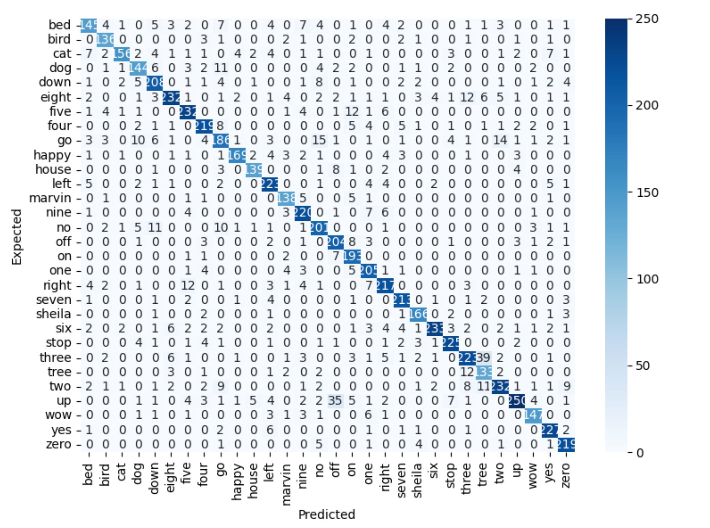

## About 
This project was craeted for GOLEM - AI student society at Warsaw University of Technology. Our task was to develop 3 models for voice command classification

## About dataset 
- around 60k audio samples, each 1 second long
- 30 classes(bed, yes, no, dog..)

## Contributors and division of responsibilities:
- Marcin Polewski - 2d convolution network, dataset wrapper
- Michał Gryglicki - 1d convolution network
- Mateusz Nawrocki - XGBoost

## CNN 2d - architecture
- convolutional layers:
    - 16 filters, kernel size = 3, ReLU(), Average Pooling
    - 32 filters, kernel size = 3, ReLU(), Average Pooling
    - 64 filters, kernel size = 3, ReLU(), Average Pooling
    - 128 filters, kernel size = 3, ReLU(), Average Pooling
- dropout(p=0.2)
- fully connected layers
    - 64 neurons, dropout=0.2
    - 32 neurons, dropout=0.2
- softmax

# CNN 2d - training parameters:
- learning rate: 0.0001
- epochs: 100
- batch size: 32
- loss function: cross entropy loss 
- optimiser: Adam

## CNN 2d - results:
- this architecutre scored 87% accuracy on test set
- below I attach confuction matrix of this model:

## Use instruction
1. download dataset from here: https://www.kaggle.com/competitions/tensorflow-speech-recognition-challenge/overview
2. move downloaded folder to main folder of this repository
3. install dependencies from requirements.txt
